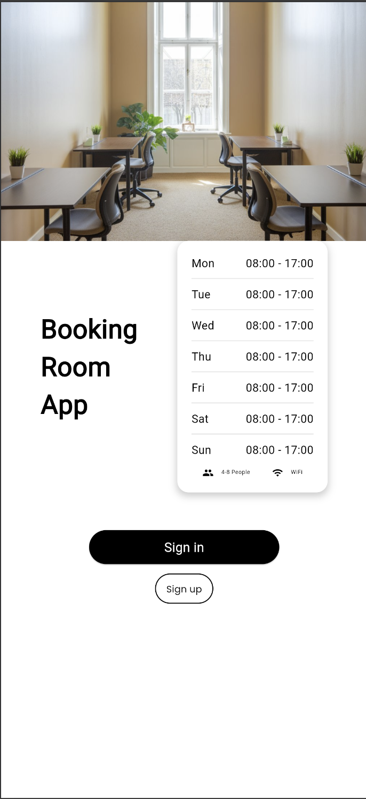
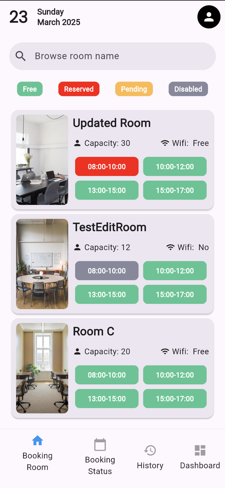
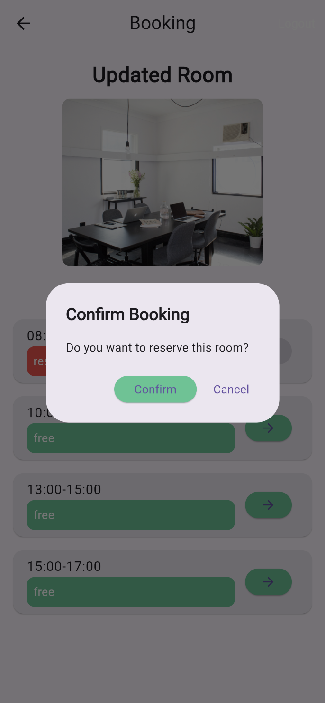
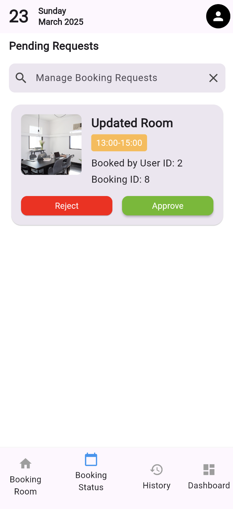
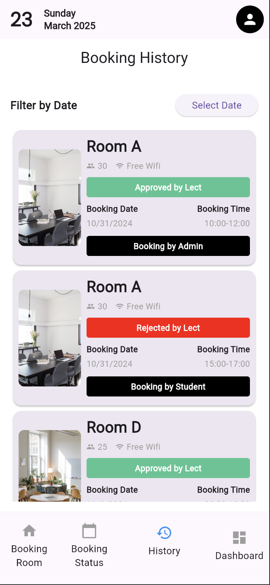
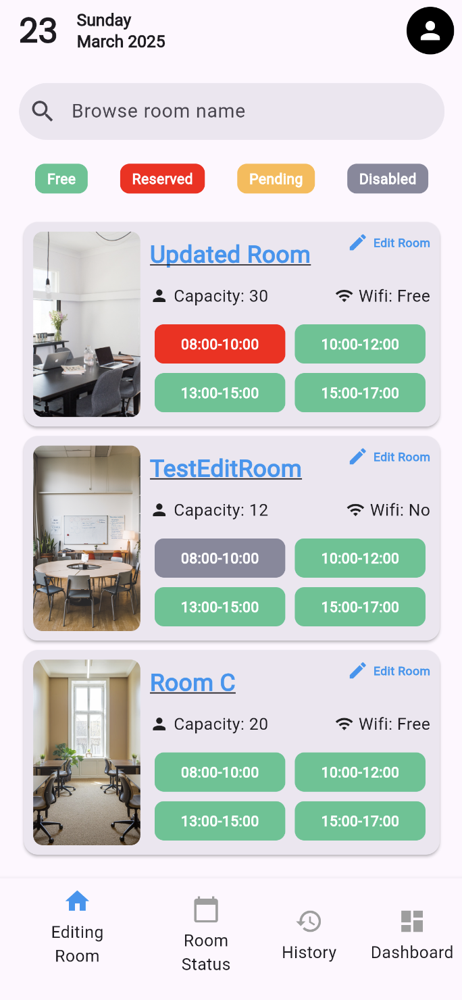
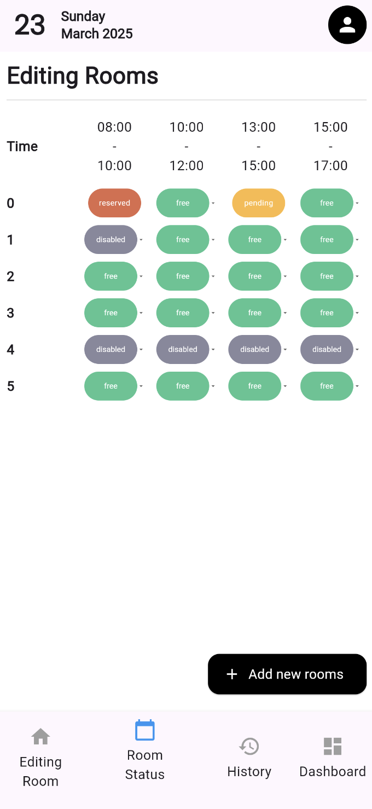
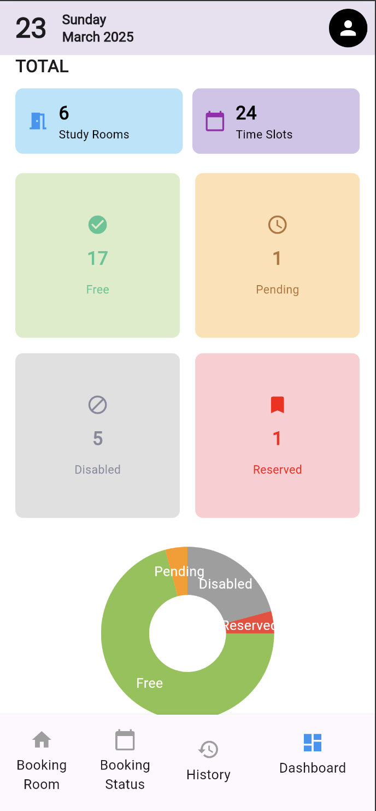

# Study Room Booking App

This is a study room booking application designed for a university campus. The application features three main roles: **Student**, **Staff**, and **Lecturer**. Each role has different access levels and functionalities to manage and book study rooms.

### **Home Page**

---
### **Student&Lecturer Home Page**

---
### **Reserving**

---
### **Lecturer Approve/Reject Requests**

---
### **Booking History**

---

### **Staff Home Page**

---

### **Staff Edit & Add Rooms**

---
### **Dashboard**

---

## Features

### **1. Student**
- **Sign Up / Sign In**: Students can register or log in to the system.
- **View Rooms**: Students can browse available study rooms.
- **Book Room**: Students can book rooms for their study sessions.
- **View Today's Booked Rooms**: Students can view the rooms they have booked for the day.
- **Booking History**: Students can see their past room bookings.
- **Dashboard**: A personalized dashboard that shows booking status and history.

### **2. Staff**
- **Sign In**: Staff can log in to the system.
- **Browse Rooms**: Staff can view all available and booked rooms.
- **Manage Rooms**: Staff can disable/enable rooms, add new rooms, and edit existing rooms.
- **View All Students' History**: Staff can access the booking history of all students, irrespective of the lecturer's decision.
- **Dashboard**: A management dashboard that shows an overview of all rooms and student bookings.

### **3. Lecturer**
- **Sign In**: Lecturers can log in to the system.
- **Browse Rooms**: Lecturers can view available study rooms.
- **View Student Booking Requests**: Lecturers can see students' room booking requests and make decisions on them.
- **View Booking History**: Lecturers can view only the booking history they have made decisions on.
- **Dashboard**: A personalized dashboard that shows booking requests and history for decisions they've made.

---

## Tech Stack
- **Backend**: Node.js with JWT Authentication
- **Frontend**: Flutter (Mobile App)
- **Database**: MySQL
- **Authentication**: JSON Web Tokens (JWT)

